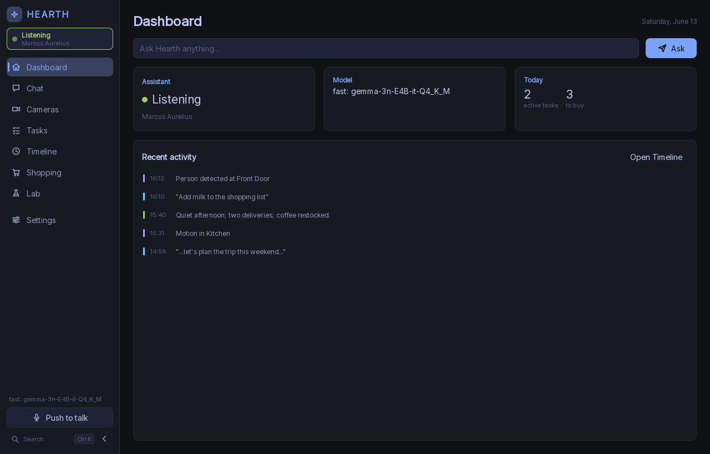
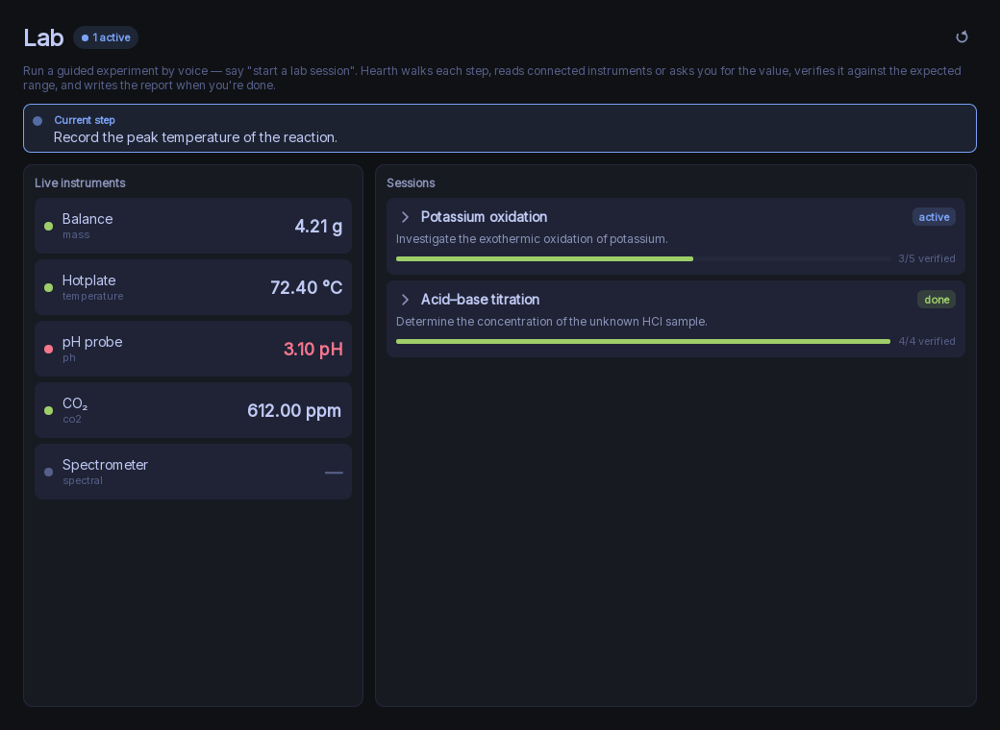
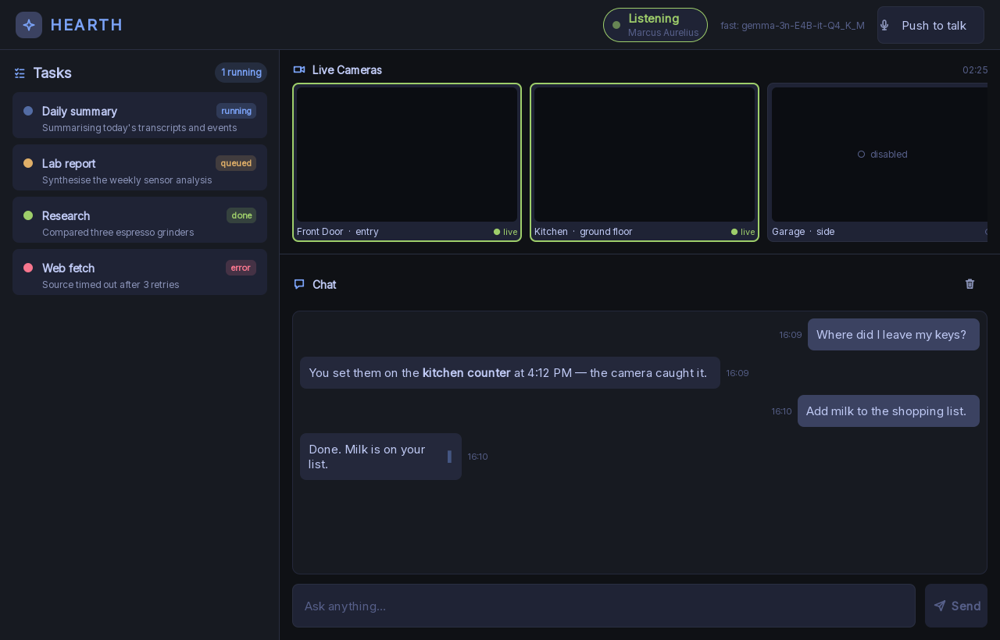
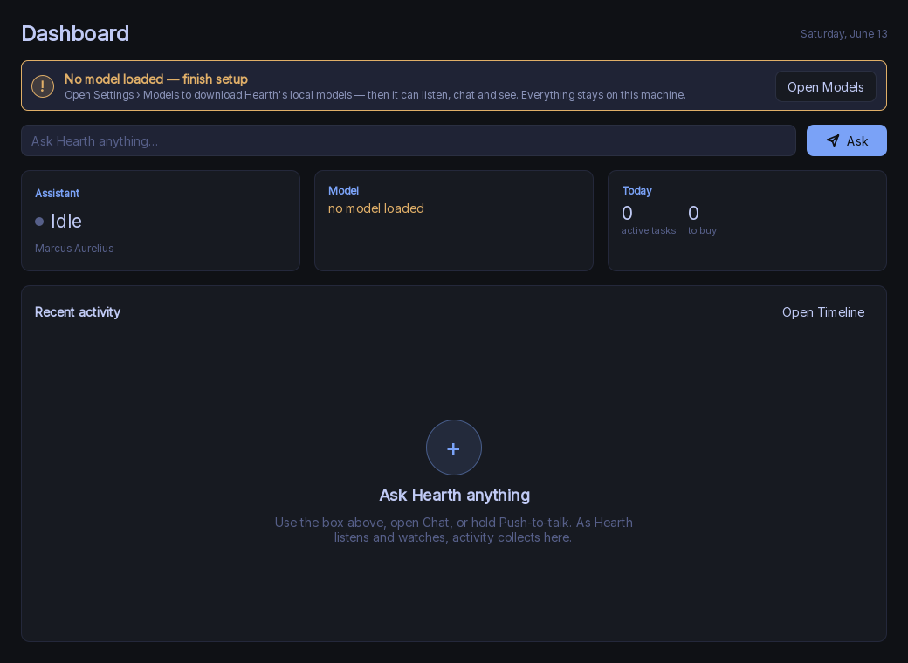

# Hearth — a fully-local AI home & lab assistant

Hearth is an always-on, **100% local** AI assistant: a C++/Qt Quick hub on your Windows machine —
no cloud, no telemetry, no account — surrounded by an ecosystem of cheap **edge devices** (cameras,
voice satellites, lab instruments, wall panels) and a **mobile app**. It listens, sees, remembers,
and acts, entirely on your own hardware and GPU.

> The product is **Hearth**. Internally the engine still carries the project's original codename,
> `Polymath`, so you'll see it throughout the code and build files — the `polymath` C++ namespace,
> `pm_*` targets, `POLYMATH_*` build options, the `polymath://` URL scheme, and so on.

## What it does

- **Voice loop** — wake word → speech-to-text (whisper.cpp) → a local LLM (llama.cpp) → text-to-speech
  (Piper). Push-to-talk or hands-free, on the hub or via **whole-home voice satellites**.
- **Tiered inference** — a resident *Fast* model for live voice, plus an on-demand *Heavy* model that
  drains a deep-work queue while the machine is idle, with a VRAM budgeter that fits the card.
- **Personalities** — the assistant can think as drop-in personas (`persona.json` bundles); ships with
  Marcus Aurelius, Ada Lovelace, and a meticulous **Lab Guide**.
- **Vision** — motion → person (YOLOv8n) → face (SCRFD + ArcFace) → "where did I last see …" object
  search via a VLM, over the hub pipeline **and** autonomous edge cameras (below).
- **Memory** — long-term semantic memory (vector recall over EmbeddingGemma), a daily summarizer, and
  per-category retention.
- **Agent toolset** — 23 tools: web search/fetch, image analysis, document & lab-report drafting,
  printing, shopping lists, reminders/tasks, camera/who's-home, Chrome automation, and the new
  **instrument + lab-session** tools.
- **🆕 Interactive lab assistant** — start a guided experiment by voice; Hearth walks each step, asks for
  (or **reads from instruments**) each measured value, **verifies it against expected ranges**, re-asks on
  anomalies, and renders a formal `.docx` lab report at the end. See [`docs/LAB.md`](docs/LAB.md).
- **🆕 Device fabric** — autonomous edge devices self-register and stream events to the hub over a small
  MQTT + HTTP contract, while still working **standalone** when the hub is off. See
  [`docs/FABRIC.md`](docs/FABRIC.md).
- **🆕 Mobile + wall panels** — a React/Capacitor app (chat-first, camera feeds, lab sessions, shopping,
  smart-home control) that reaches cameras **directly even with the hub offline**; plus a touch **panel
  mode** (`Hearth.exe --panel`) for in-wall kiosks. See [`docs/PANELS.md`](docs/PANELS.md).

> **Privacy & security.** Everything runs locally. Ambient listening / face recognition default ON but
> are fully toggleable behind a master kill-switch, with per-category retention. The SQLite database is
> **encrypted at rest** (SQLCipher/AES) with a per-install, OS-protected key. Edge cameras store
> people-only clips on their **own SD card** (net-0 hosting, no subscription). See
> [`docs/PRIVACY.md`](docs/PRIVACY.md).

## Screenshots

|  |  |
| --- | --- |
| **Desktop dashboard** — ask anything, live status, recent activity | **Lab cockpit** — live instruments + guided, range-verified sessions |
|  |  |
| **Wall-panel / kiosk mode** (`Hearth.exe --panel`) | **First run** — guided, local-only model setup |
|  |  |

<sub>Rendered from the offscreen `capture_views` harness, so they match the shipping UI exactly.</sub>

## The hardware ecosystem 🆕

Hearth is sold as a hub **and** as a tiered line of edge devices that are useful on their own. The cheap
camera tiers do **on-device person detection** and keep **only clips with people** on a local SD card —
so a camera-only customer pays no hosting and needs no subscription.

| Class | Budget → Flagship | On-device "is it a person?" |
|---|---|---|
| **Cameras** | XIAO ESP32-S3 Sense (~$14) → +Grove Vision AI V2 (~$30) → CanMV-K230 (~$30–50) → Pi 5 + Hailo (~$200) | trigger-grade → **reliable** YOLO |
| **Voice satellites** | ESP32-S3 + I²S mic (~$8) → ReSpeaker Lite (~$37) → XVF3800 4-mic (~$55) | on-device microWakeWord |
| **Lab modules (HMM)** | ESP32-S3 + Qwiic sensor tiles (mass, RTD/thermocouple temp, pH, CO₂, pressure, V/I, spectral) | — |
| **Wall panels** | Fire HD + PWA → Pi 5 + Touch Display 2 (native Qt) → PoE Android panel | — |

Full SKU/BOM table with sources, plus the firmware projects that drive each, are in
[`docs/HARDWARE.md`](docs/HARDWARE.md) and [`firmware/README.md`](firmware/README.md).

## Install (end users)

Grab the latest installer from the repo's **Releases** and run it:

- `Hearth-<version>-win64-cuda-Setup.exe` — NVIDIA GPU build (CUDA, much faster).
- `Hearth-<version>-win64-cpu-Setup.exe` — CPU-only build (works anywhere, slower).

On first launch with no models, Hearth guides you through a model fetch + a GPU/driver check. Models are
**not** bundled (they're ~GBs); the first-run wizard downloads them. See
[`docs/PACKAGING.md`](docs/PACKAGING.md) for the minimal vs full model sets and how to bring your own
GGUF/ONNX.

## Build from source (developers)

Windows 10/11, MSVC 2022, CMake ≥ 3.25. Native engines (llama.cpp, whisper.cpp, SQLCipher, …) are
vendored and built from source; Qt 6.6, OpenCV, ONNX Runtime and the small vcpkg libs come from
`build/deps` + vcpkg.

**One build, one binary.** `scripts/build.ps1` produces a single `Hearth.exe` that ships ggml's CPU
backend (as per-ISA DLLs picked at runtime) plus — when a CUDA toolkit is present at build time — a
`ggml-cuda.dll`. At startup it detects an NVIDIA GPU and uses it, falling back to CPU automatically.
No separate CPU/CUDA trees.

```powershell
# THE build — auto: builds the CUDA backend if a toolkit is found, else CPU-only.
pwsh scripts/build.ps1                    # -> build/dist/bin/Release/Hearth.exe
#   -Flavor cpu    force a CPU-only binary (no CUDA backend, no toolkit needed)
#   -Flavor cuda   require the CUDA toolkit and build ggml-cuda.dll

# Fetch the default local models
pwsh scripts/fetch-models.ps1            # add -Minimal to skip the big optional ones

# Run (hub) — or add --panel for the in-wall kiosk dashboard
build/dist/bin/Release/Hearth.exe
```

This is powered by `POLYMATH_BACKEND_DL` (ggml's `GGML_BACKEND_DL`): the backends build as
runtime-loadable libraries and the runtime GPU/CPU choice lives in `src/inference/vram_budget.cpp`,
which queries ggml's device registry — so the binary has **no hard CUDA dependency**. The older
split `scripts/build-cpu.ps1` / `scripts/build-gpu.ps1` remain for the legacy two-tree layout.

Run the test suite from a tests-enabled tree (`scripts/build-cpu.ps1` configures one):
`ctest --test-dir build/cpu -C Release` (**14 suites**: core, tools, audio, agent, vision, inference,
memory, privacy, integration, ui, phase2, **fabric, instruments, lab_session**). CI: `scripts/ci.ps1`.

The **mobile app** (`app/`) builds with `npm ci && npm run build`; the **edge firmware** (`firmware/*`)
builds per-project with PlatformIO / ESP-IDF / CanMV — see each project's README.

Package a distributable + build the installer:

```powershell
pwsh scripts/package.ps1 -Flavor cuda    # stages dist/ + a portable zip
& "$env:LOCALAPPDATA\Programs\Inno Setup 6\ISCC.exe" /DAppVersion=0.1.0 /DFlavor=cuda scripts/installer/polymath.iss
```

See [`docs/SHIP.md`](docs/SHIP.md) for the full release checklist.

## Repository layout

```
src/core/        shared contracts: EventBus, DB/schema (+ SQLCipher), config, privacy, retention
src/inference/   llama.cpp backend, tiered model manager, VRAM budget, GBNF grammar
src/scheduler/   deep-work task queue, idle detector, proactive engine
src/audio/       capture, wake word, VAD, whisper ASR, Piper TTS, network (satellite) audio source
src/vision/      camera workers, motion, YOLO, face recognition, visual memory / finder
src/memory/      SQLite store, vector index, daily summarizer
src/agent/       tool registry + 23 tools (web, docs, print, shopping, home, memory, browser, lab/instrument)
src/fabric/      🆕 device fabric: edge devices → EventBus + schema (MQTT optional + HTTP ingest)
src/gateway/     embedded HTTP + WebSocket gateway, device-token auth, relay tunnel
src/personality/ hot-loadable persona bundle manager
src/app/         AppController facade + main.cpp (--panel kiosk flag)
src/ui/          Qt Quick (QML) views + C++ view-model glue (+ PanelMode kiosk)
app/             🆕 React + Capacitor mobile/web app (chat-first; direct-to-camera; lab/instrument screens)
cloud/relay/     optional reverse-tunnel relay for off-LAN access (off by default)
firmware/        🆕 edge firmware: common lib + 5 camera tiers, voice satellite, lab module (HMM)
docs/            architecture, build, models, privacy, packaging, ship, FABRIC, HARDWARE, LAB, status
```

## Documentation

- [`docs/ARCHITECTURE.md`](docs/ARCHITECTURE.md) — services, the two frozen contracts, the device fabric.
- [`docs/FABRIC.md`](docs/FABRIC.md) — the edge-device wire contract (MQTT/HTTP, pairing, audio plane).
- [`docs/HARDWARE.md`](docs/HARDWARE.md) — the SKU/BOM ladder and which firmware drives each.
- [`docs/LAB.md`](docs/LAB.md) — the interactive lab-assistant workflow.
- [`docs/API.md`](docs/API.md) · [`docs/SCHEMA.md`](docs/SCHEMA.md) — REST/WS + database contracts.
- [`docs/PRIVACY.md`](docs/PRIVACY.md) · [`docs/PANELS.md`](docs/PANELS.md) · [`docs/PACKAGING.md`](docs/PACKAGING.md) · [`docs/BUILD.md`](docs/BUILD.md) · [`docs/SHIP.md`](docs/SHIP.md)

Project history and the parallel build plan live under [`docs/`](docs/) and [`docs/sessions/`](docs/sessions/).
