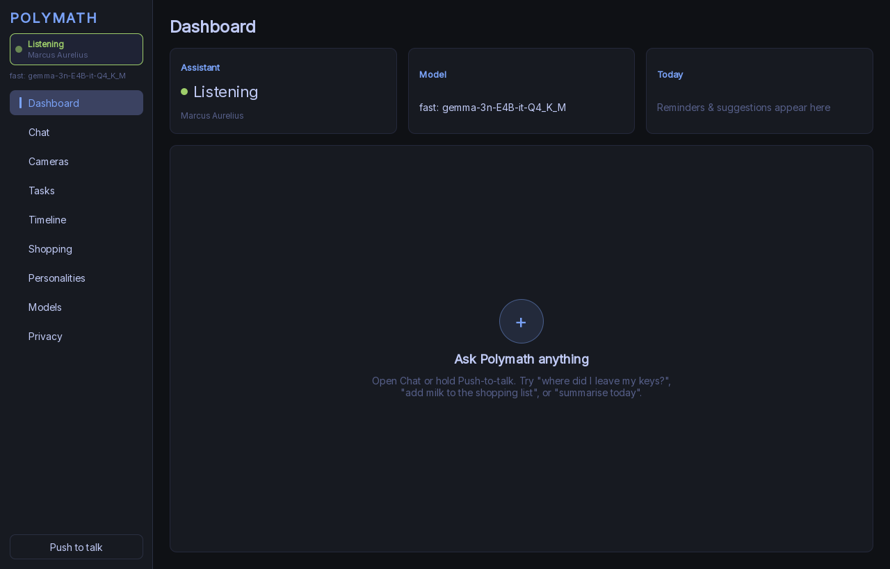
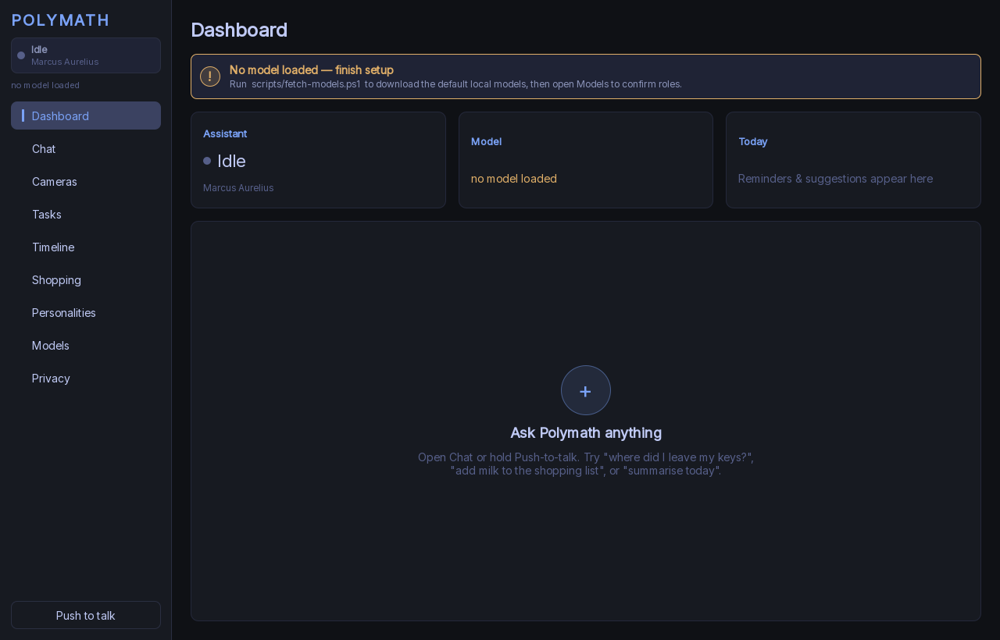
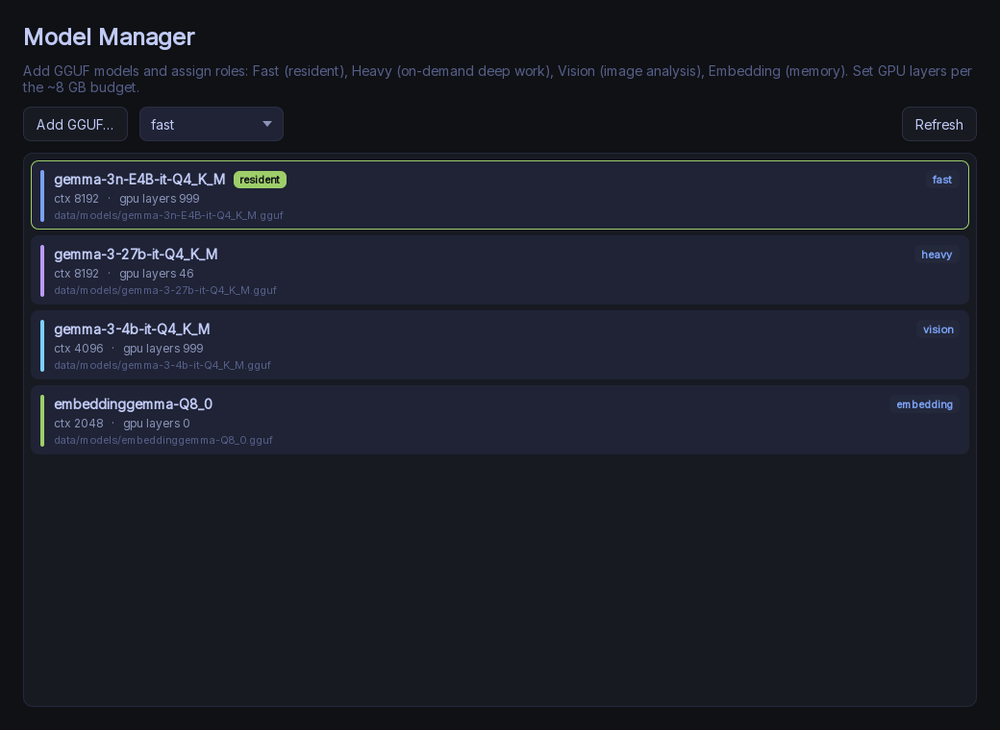
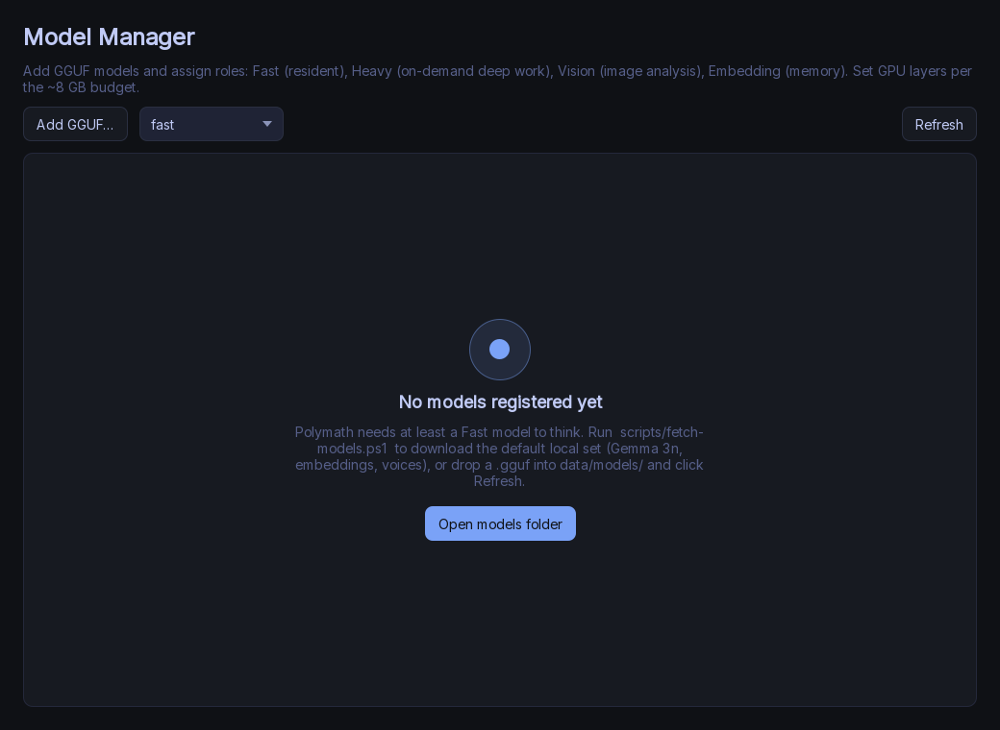
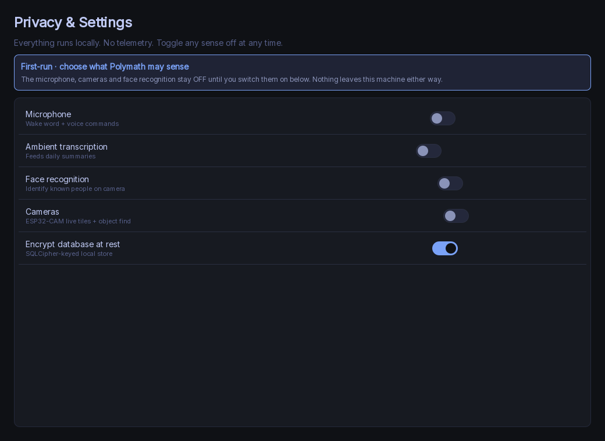
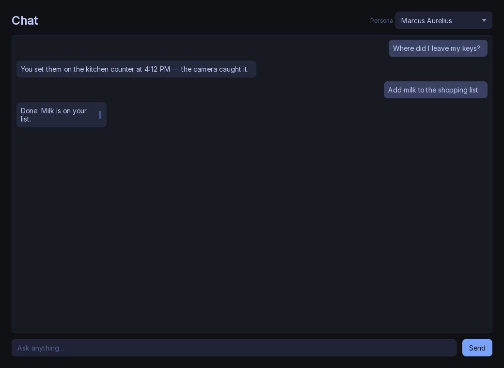
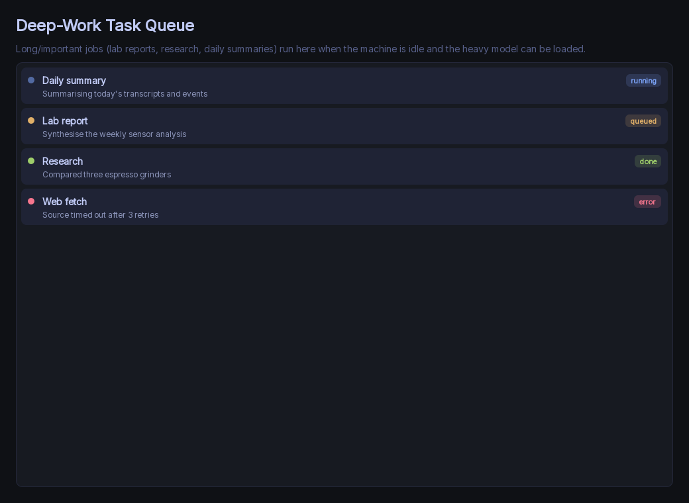
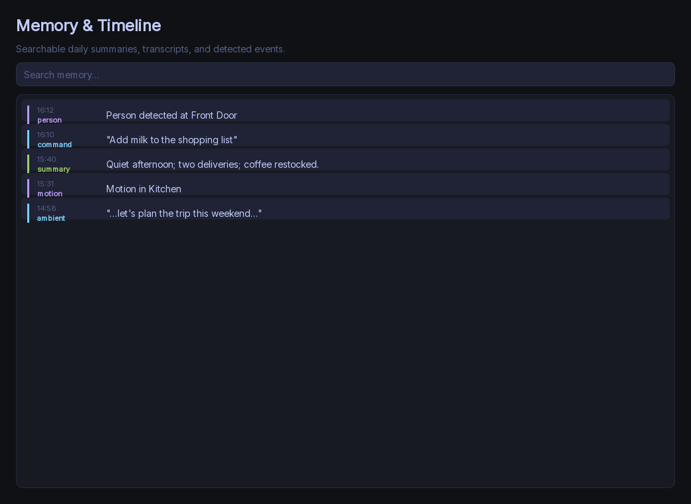
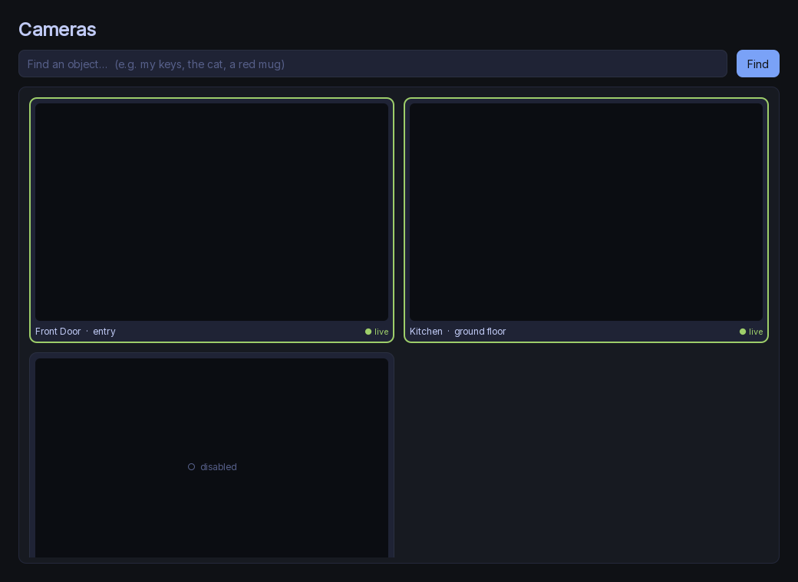
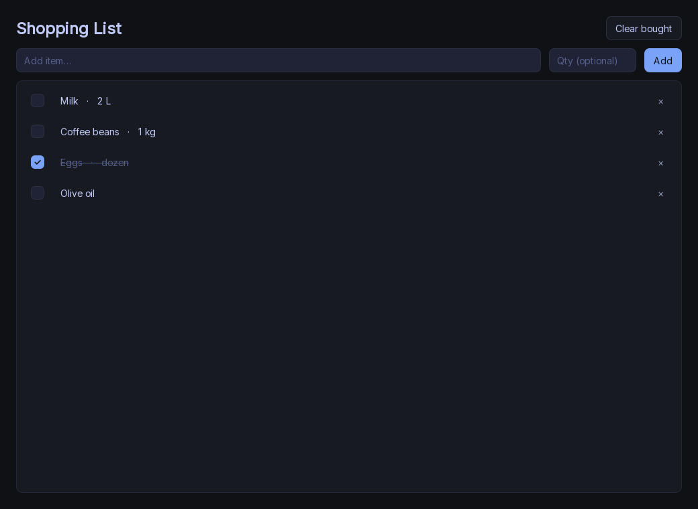

# Wave 2 · Card F — GUI / UX audit + polish — report

**Status: PASS.** All 10 surfaces (Main shell + 9 views) render headless to PNG,
are themed into one cohesive dark look, populate from their view-models with
sensible empty / loading / error states, and carry a first-run / cold-start
flow. The `QFontDatabase: Cannot find font directory` warning is gone, the real
app loads the themed QML and stays up, and `build-cpu.ps1` is green with
**ctest 10/10** (was 9/9 — added `ui`).

Owned only `src/ui/` (QML + view-model glue + the ui `CMakeLists`) plus the
append-only test registration in `tests/CMakeLists.txt`. No edits to other
`src/` modules, the backend services, or the frozen contracts.

---

## How the screenshots were captured (headless, no display)

The card asks for screenshots of every view but I must not depend on an
interactive display. I built a small **offscreen capture harness**,
`src/ui/tools/capture_views.cpp` → `capture_views.exe`, that:

- runs under `QT_QPA_PLATFORM=offscreen` with the **software** scene-graph
  backend (deterministic, GPU-free);
- installs a **stub `app`** context object + **stub list models** that mirror the
  `AppController` surface the QML binds to (the same Q_PROPERTYs, Q_INVOKABLEs and
  role-named list models), so the real view QML renders unchanged — no backend,
  no models, no 28 GB download, no mic/camera;
- loads each view and `QQuickWindow::grabWindow()`s it to PNG;
- seeds **populated** data by default and **empty / first-run** data with
  `--empty`, so both states are captured.

```
capture_views.exe <out-dir>          # populated
capture_views.exe <out-dir> --empty  # empty / first-run
```

This does **not** link `pm_app` (no service threads), so it is fast and safe to
run on the shared machine. The same stub approach backs the new `ui` ctest.

`main.cpp`/`AppController` live in `src/app` (outside this card), so — per the
rules — I drove rendering from this `src/ui` harness rather than adding a
`--screenshot` switch to the app's `main`.

PNGs live in [`reports/F-gui/`](F-gui/): `01-main-shell`…`10-privacy` (`.png`
populated, `-empty.png` first-run). 20 files, all generated this session.

### Views captured (20 PNGs)
| # | View | populated | empty / first-run |
|---|------|-----------|-------------------|
| 01 | Main shell | `01-main-shell.png` | `01-main-shell-empty.png` (cold-start) |
| 02 | Dashboard | `02-dashboard.png` | `02-dashboard-empty.png` (no-model banner) |
| 03 | Chat | `03-chat.png` | `03-chat-empty.png` |
| 04 | Cameras | `04-cameras.png` | `04-cameras-empty.png` |
| 05 | Tasks | `05-tasks.png` | `05-tasks-empty.png` |
| 06 | Timeline | `06-timeline.png` | `06-timeline-empty.png` |
| 07 | Shopping | `07-shopping.png` | `07-shopping-empty.png` |
| 08 | Personalities | `08-personalities.png` | `08-personalities-empty.png` |
| 09 | Models | `09-models.png` | `09-models-empty.png` (no-models guide) |
| 10 | Privacy | `10-privacy.png` | `10-privacy-empty.png` (first-run opt-in) |












---

## What was broken (verified by rendering)

1. **Controls were un-themed.** `QtQuick.Controls.Basic` does not inherit
   container colours, so every `Button` / `ComboBox` / `TextField` / `Switch` /
   `CheckBox` rendered in the **light system style** — grey buttons, a white
   dropdown, light toggles — floating on the dark shell. (See the original raw
   Models / Privacy: light "Add GGUF…" / "Refresh" buttons, a system ComboBox,
   pale switches.)
2. **`QFontDatabase: Cannot find font directory …/lib/fonts`** fired at every
   boot. Qt 6 no longer ships fonts and the windeployqt tree has no `lib/fonts`,
   so the app had no bundled UI family.
3. **Thin / inconsistent empty states.** Most lists had a single grey
   "no tasks queued" line; no loading/connecting affordances; no first-run
   guidance when there are no models / no cameras / no transcripts.
4. **No cold-start flow.** Nothing guided a fresh user (no models) toward
   `fetch-models`, and the listening/idle state was a one-line label.

Bindings themselves were **correct** — every `required property` in the
delegates matches a `roleNames()` entry in the C++ models (verified
cross-reference), and the `app.*` calls resolve. The problem was look, states
and flow, not wiring.

---

## What I changed (files + why)

### Theming + font (cohesive dark style)
- **`src/ui/qml/Style.qml`** *(new, QML singleton)* — single source of truth for
  the Tokyo-Night palette, radii, spacing, type ramp and the app font family.
  Every view/control reads from it.
- **`src/ui/qml/controls/`** *(new)* — themed wrappers over Basic that paint
  themselves from `Style`: `PmButton` (flat / outlined / accent), `PmTextField`
  (focus ring), `PmComboBox` (dark field + popup + delegate + custom arrow),
  `PmSwitch`, `PmCheckBox`, `PmItemDelegate`, `PmToolButton`, and an
  **`EmptyState`** component (drawn badge + title + hint + optional CTA, used for
  every empty/loading/error placeholder).
- **`src/ui/fonts/Inter.ttf`** *(new, SIL OFL — `LICENSE.txt` included)* —
  bundled as a Qt resource and loaded app-wide by a `FontLoader` in `Main.qml`
  (`Style.fontFamily`), so type is consistent and identical headless vs desktop.
- **`src/ui/CMakeLists.txt`** — register `Style.qml` as a singleton, add the
  controls + `RESOURCES fonts/Inter.ttf`, and **`NO_PLUGIN`** on the QML module
  (see Build notes), plus a POST_BUILD step that deploys `Inter.ttf` into
  `<exedir>/lib/fonts` — the directory Qt scans at startup — which **silences the
  `QFontDatabase` warning** at its source.

### Views fleshed + bound (all 9 + shell)
- **`Main.qml`** — `FontLoader`; nav rail with an active-page accent bar; a
  proper **listening/idle affordance** (pulsing dot + state card); level-coloured
  toasts; push-to-talk turns accent + "● Listening…" while held.
- **`Dashboard.qml`** — **cold-start banner** ("No model loaded — finish setup" →
  `fetch-models`) shown when there's no Fast model; status/model/today cards;
  themed empty hint.
- **`ChatView.qml`** — left/right chat bubbles (you vs assistant), animated
  streaming cursor, themed persona `PmComboBox`, empty "Start a conversation"
  state.
- **`CamerasView.qml`** — themed find bar; tiles with live (green) / connecting /
  disabled states; themed find-answer banner; "No cameras configured" guide.
- **`TaskQueueView.qml`** — status-coloured dots + pills
  (running/queued/done/error), running pulse, empty "no deep-work tasks" guide.
- **`TimelineView.qml`** — category colour rails (event/transcript/memory),
  themed debounced search, distinct "No matches" vs "empty" states.
- **`ShoppingView.qml`** — themed checkbox/fields/buttons, hover rows, strike-out
  done items, empty state.
- **`PersonalitiesView.qml`** — themed selectable rows + active marker, empty
  state.
- **`ModelManagerView.qml`** — themed buttons/combo, role accent stripes +
  "resident"/role badges, and a **first-run no-models guide** pointing at
  `scripts/fetch-models.ps1` with an "Open models folder" CTA.
- **`PrivacyView.qml`** — themed accent switches with sub-captions + separators,
  and a **first-run opt-in banner** (senses default OFF).

### Tooling + test
- **`src/ui/tools/capture_views.cpp`** *(new)* — the offscreen screenshot harness
  described above.
- **`tests/test_ui_e2e.cpp`** *(new)* + **`tests/CMakeLists.txt`** (append-only) —
  ctest `ui`: loads the shell + all 9 views offscreen against a stub context and
  asserts each instantiates with **zero QML errors** (guards role-name drift, bad
  imports, missing bindings). Green: `10/10` views.

---

## Build notes (the two real gotchas, fixed)

- **`import Polymath` failed in the real app** — adding the Style singleton /
  themed controls meant the views now `import Polymath`. With the default static
  QML module, the generated `qmldir` declares `plugin pm_uiplugin`; the engine
  then demands that static plugin be imported into the exe, which `src/app/
  main.cpp` (loads `Main.qml` by URL, no plugin import) does not — so the app
  exited 2 with *module "Polymath" plugin "pm_uiplugin" not found*. **Fix:**
  `NO_PLUGIN` on `qt_add_qml_module`. This module registers **zero C++ QML
  types** (the data models are context properties; the camera feed is an image
  provider), so every type is a `.qml` file that resolves straight from the
  embedded resources — no plugin needed, and **no change to `src/app`**.
- **`add_custom_command(TARGET …)` is directory-scoped** — the font-deploy step
  can't attach to `Polymath` (defined in `src/app`). It hangs off `capture_views`
  instead, which shares the `bin/Release` output dir, so `Inter.ttf` still lands
  beside `Polymath.exe`; the default ("all") build always builds `capture_views`.

---

## Verification

- **`pwsh scripts/build-cpu.ps1`** — green end-to-end (configure → build →
  ctest → windeployqt).
- **`ctest` — 10/10 pass** (`core, tools, audio, agent, vision, inference,
  memory, privacy, integration, ui`). The pre-existing 9 still pass; the new `ui`
  test is the added integration test for this card.
- **Real app, headless** (`QT_QPA_PLATFORM=offscreen ./Polymath.exe`): loads
  `Main.qml` (no plugin/QML errors), `AppController initialized`, stays up — and
  the log shows **0 `QFontDatabase` warnings** (was 1/boot). `lib/fonts/Inter.ttf`
  is deployed.
- **20 PNGs** captured (populated + first-run) for all 10 surfaces; reviewed for
  theme/font/binding correctness — cohesive, no light-style controls, no tofu
  glyphs.

---

## Residual gaps

1. **Two action buttons are presentational** until the backend grows invokables:
   Model Manager "Add GGUF…" / "Open models folder" call a proposed
   `app.openModelsFolder()`, and the role ComboBox / add-model path needs an
   `app.addModel(path, role)`. They render and are wired by name; calling them
   today is a harmless no-op (a console warning), so wiring later is a backend-
   only change with no QML edit. (See contract requests.)
2. **First-run banners infer cold-start from `modelStatus`.** The Dashboard
   cold-start banner works off `modelStatus === "no model loaded"`. The Privacy
   first-run opt-in banner is bound to `app.firstRun`, which the real
   `AppController` doesn't expose yet, so in-app it stays hidden (the capture
   `--empty` run shows the intended design). A real `hasModels`/`firstRun`
   property would make it live. (See contract requests.)
3. **Glyphs limited to safe code points.** The offscreen software renderer has no
   emoji/symbol font fallback, so icons use widely-available glyphs (●, ○, ×, +)
   and drawn shapes rather than emoji — intentional, to render identically
   headless and on the desktop.
4. **Camera tiles show black in captures** — the stub installs no image provider,
   so there are no JPEG frames to draw (expected); the live border / connecting /
   disabled chrome all render. The real app feeds frames via
   `image://cameras/<id>`.

## Contract requests
Appended to [`../contract-requests.md`](../contract-requests.md) under
**F-gui** — additive `AppController` surface (not a frozen-contract edit):
`hasModels`/`firstRun` properties, `openModelsFolder()`, and an `addModel()` /
role-assign path. All coded around; none blocking.
